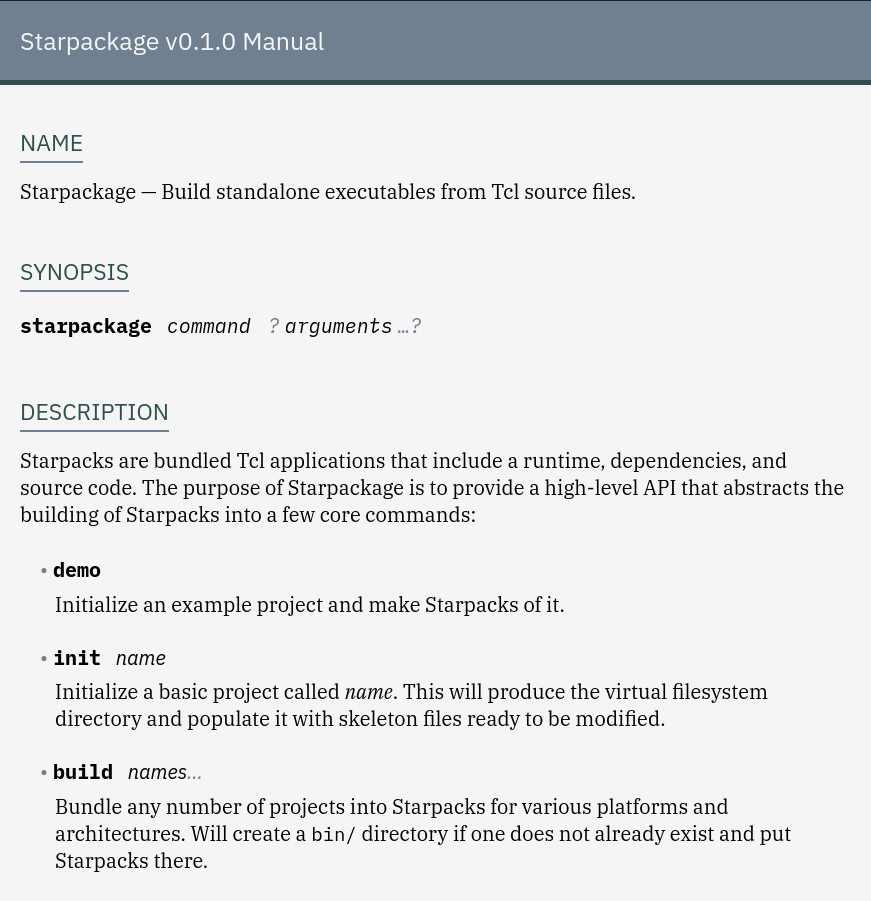

# Manumatic

This repository contains an example
[Pollen](https://docs.racket-lang.org/pollen/) project that generates
Tcl/Tk documentation structured according to the establish conventions
of the [Tcl manual](https://www.tcl.tk/man/tcl8.6.11/TclCmd/Tcl.html)
and with a clean web design.



## Dependencies

* Make, etc.
* [Racket](https://www.racket-lang.org)
* Pollen

## Usage

To create new documentation simply clone this repository and modify the
contents of `src/manual/starpackage`. For most use cases the only changes
required are:

1. Rename the directory from `src/manual/starpackage` to whatever else.
2. Rename the `src/manual/starpackage/starpackage-v0.1.0.html.pm`.
3. Edit that `.html.pm` Pollen preprocessor file.
4. `$ make`
5. Look in `dist/` for the processed manual files (HTML, CSS, etc).

To start live-reloading local development server, type `$ make dev`
and browse `http://localhost:8080/index.ptree`.

## Why Racket? Why Pollen?

Racket is a programming language for programming programming languages.
In other words, it is Scheme dialect particularly well-suited for creating
domain-specific languages. 

Pollen is a web publishing system written in Racket. Programming Pollen
requires some basic knowledge of Racket, but once Pollen is programmed
for a given purpose, authoring new documents is straightforward. In the
case of Tcl/Tk documentation, the established convention is to write
a few sections of content per manual page:

* Name
* Synopsis
* Description
* Examples
* See Also
* Keywords

In our Pollen preprocessor file, to begin a new section we simpy type
the following:

```
◊section["Name"]{
  Starpackage — Build standalone executables from Tcl source files.
}
```

Pollen uses the lozenge (◊) to mark its functions. Manumatic defines
a number of template functions for sections, commands, parameters, lists, etc. In the above code we can see that to
define a section we call `◊section` followed a name parameter `"Name"`
in square bracktes and the main text of the secton in curly braces.
These functions are defined in `src/pollen.rkt`, but authors of
documentation do not need to understand the implementation details.
All that is required to use the interface is to modify the values
wrapped in braces or quotes. For more, see the
[Pollen manual](https://docs.racket-lang.org/pollen/).

## License

This code is free and open source software available under the terms
of the Zero-Clause BSD (0BSD) License. See `./LICENSE` for details.
